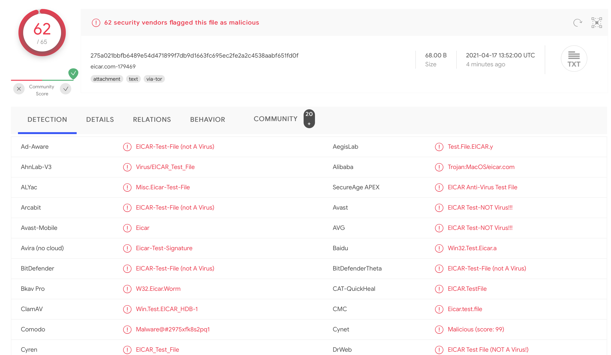

# Station Blanche

## Définitions 

**Station blanche :** Poste de travail isolé du réseau opérationnel dédié à l'analyse des médias amovibles afin de déterminer si elle peut être utilisée sur ledit réseau.  

## Constat

Enormément de piratage passent par les médias amovibles. Les attaquants joue sur un maillon faible, l'humain qui a un défaut : la curiosité.

Il est très simple de laisser une clé usb infectée par terre, en plein milieu d'un couloir ou devant les bureaux d'une entreprise que vous ciblez.

La curiosité de l'humain va alors le pousser à brancher la clé usb sur son poste et il n'y a pas énormément de moyen de s'assurer de la légitimité des données 
avant de l'avoir branchée. Si l'antivirus prévient l'utilisateur, il y a de grandes chance pour qu'il accepte le risque. Tout un réseau peut alors être compromis.

Une solution peut être de mettre en place une station blanche.

## Respect du DICT

| Biens sensibles   | D | I | C | T |
|---|---|---|---|---|
| Logiciels du produit | X | X |   | X |
| Journaux d'évènements | X | X |   |  |
| Journaux de transfert de fichiers | X | X |   | X |
| Données des fichiers à analyser |  | X |   |  |
| Résultats d'analyse |  |  | X |  |

**Logiciels du produit** : Les logiciels du produit (système d’exploitation, application, base de signatures virales, etc.) sont considérés comme des biens sensibles. Ils doivent être protégés en disponibilité, intégrité et authenticité.

**Journaux d'évènements** : Les évènements de sécurité sont journalisés localement et de façon déportée. Ce bien est à protéger en disponibilité et intégrité. Les journaux doivent être également authentifiés lorsqu’ils sont déportés

**Journaux de transfert de fichiers** : Les informations liées au transfert de fichier(s) sont journalisées localement et de façon déportée. Ce bien est à protéger en disponibilité et intégrité. Les journaux doivent être également authentifiés lorsqu’ils sont déportés.

**Données des fichiers à analyser** : Le fichier à analyser doit être protégé en intégrité

**Résultat d'analyse** : Les données issues de l’analyse du fichier par le produit doivent être protégées en confidentialité.

## Menaces à prendre en compte sur une Station Blanche

Les menaces peuvent provenir de différents horizons :

- Utilisateur légitime : insertion d'un média compromis ou réalisation d'une erreur de manipulation.

- Utilisateur non autorisé : accès physique à la station blanche.

- Attaquant avec droits administrateurs : l’attaquant a réussi à compromettre le compte d’un administrateur.

## Système d'exploitation de station blanche

### OS

Le système d'exploitation choisit est Q4OS qui utilise un base Debian. C'est une distribution relativement stable, légère et qui a fait ses preuves au cours des années. Cela va donc dans le sens de la station blanche qui devra être, potentiellement, réinstallée plusieurs fois.

De plus, le budget sécurité informatique est souvent très faible. Il faut donc que l'OS tourne sur n'importe quel ordinateur.

Le système d'exploitation a été durcît ([hardening](./docs/hardening.md)) grâce aux recommandations de l'ANSSI ainsi que l'outil `lynis`.

La langue de la station blanche est le français afin qu'elle soit compréhensible par tous.

### Configuration minimale requise 

- RAM: 128 MB
- CPU: 300 MHz 
- Espace de stockage : 3 Gb

### Chiffrement

Le système d'exploitation est chiffré. TODO : Rajouter l'algorithme de chiffrement.

### Compte utilisateur

Pour la preuve de concept, l'identifiant et le mot de passe sont simples. Dans une utilisation en entreprise, il est conseillé de changer ce mot de passe et mettre une politique de changement de mots de passe. L'ANSSI recommande de changer tous les 90 jours.

Le mot de passe de l'utilisateur `root` est uniquement connu du gestionnaire de la station blanche et le changement fréquent du mot de passe est aussi conseillé.

Nom d'utilisateur : `statioblanche`

Mot de passe : `statioblanche`

## Fonctions de la station blanche

Pour les utilisateurs qui souhaitent utiliser la station blanche, il suffit de brancher la clé USB à scanner et d'exécuter le fichier `scan.sh`.

Celui-ci va lancer l'outil `ClamAV` et `VirusTotal`. Les détails des arguments utilisés avec l'outil `Clamav` par le script `scan.sh` sont [disponibles ici](./docs/clamav.md).

## Mise à jour de la station blanche

Régulièrement, il faut faire des mises à jour du système d'exploitation de la station blanche ainsi que de la base de données de signature de ClamAV. Pour cela il faut la brancher au réseau. L'utilisation d'un pare-feu est donc recommandé.

## Pare-feu

Le pare-feu choisit est UFW. Il est simple d'utilisation et efficace. Ce pare-feu est utile lorsque l'administrateur de la machine va la connecter au réseau pour faire des mises à jour du système d'exploitation, de la base de données des signatures, etc.

Sont autorisés :
- DNS
- HTTP / HTTPS

Facultatif (non recommandé en production) :
- Git

Le firewall est configuré afin de stocker des logs qui sont stockés dans `/var/log/ufw.log`.

## Automatisation de l'installation de la station blanche

### Création d'une OVA

Lien vers l'OVA (8Gb) : https://drive.google.com/file/d/1Ge5rGOlfr10B0fTT5qmDuAExrGmnSKzv/view?usp=sharing TODO : Remettre une version plus récente de l'OVA.

### Création d'une ISO

Lors de la création et du pentest, il est fréquent que la station blanche devienne compromise. La création d'un image peut alors être intéressant.

Lien vers l'ISO : (TODO)

### Scan régulier de tout l'OS

Grace à une CRON, l'entièreté de l'OS est scannée toutes les semaines, ce qui prend dans une crontable la forme : `0 0 * * 0`.

Le scan de tout l'OS est effectué avec l'outil `ClamAV` : `clamscan -i -r -z / > /root/global-scan-$(date "+%A-%B-%d-%T-%y").txt` et est uniquement accessible pour l'administrateur.

La ligne dans la crontab est donc représentée par : `0 0 * * 0 clamscan -i -r -z / > /root/global-scan-$(date "+%A-%B-%d-%T-%y").txt`.

## Post création de la station blanche

Il est indispensable de pentester la station blanche.

## Facultatif

Pour les personnes qui ne souhaiteraient pas utiliser l'image ou le fichier ova mais qui voudrait utiliser certains outils ou exécuter le script sur une autre machine, il vous suffit de cloner se repository et d'exécuter en administrateur le script `install-all.sh`. Celui-ci va venir exécuter tous les scripts qui se trouvent dans le répertoire `installs`.

Si un outil ne vous intéresse pas, vous pouvez le supprimer du répertoire.

Pour vérifier le bon fonctionnement de la station blanche, vous trouverez le fichier de test antimalware Eicar. Il est inoffenssif mais permet de lever des alertes.

Voici le résultat de ce fichier sur VirusTotal par exemple :

## Ressources

- https://askubuntu.com/questions/4508/how-do-i-safely-use-a-virus-infected-usb-drive-in-ubuntu

- https://askubuntu.com/questions/134874/how-to-auto-scan-any-plugged-in-usb-storage-device-with-clamav

- https://jpwils.ch/git/jpwilsch/station-blanche

- https://www.ssi.gouv.fr/guide/recommandations-de-securite-relatives-a-un-systeme-gnulinux/

- https://cisofy.com/lynis/

- https://www.ssi.gouv.fr/guide/profil-de-fonctionnalites-et-de-securite-sas-et-station-blanche-reseaux-non-classifies/
