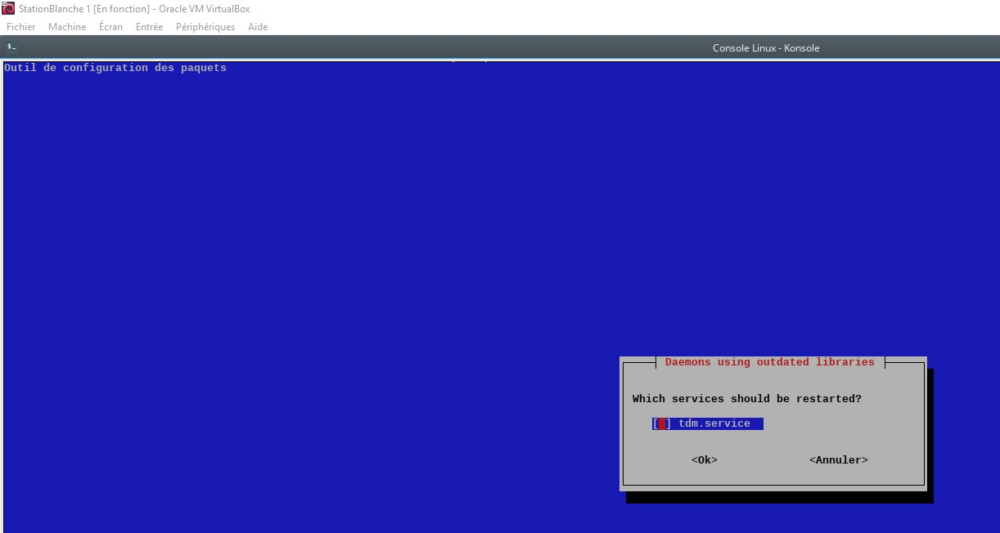

# Hardening du système

L'hardening va se baser sur les recommandations de l'ANSSI : https://www.ssi.gouv.fr/guide/recommandations-de-securite-relatives-a-un-systeme-gnulinux/

Le fichier : [Rapport de l'ANSSI](linux_configuration-fr-v1.2.pdf)

## Outils disponibles pour le gestionnaire de la station blance

### Apt-listbugs

`apt-listbugs` est un utilitaire qui se lance automatiquement à l'installation d'un nouveau paquet, et va chercher les rapports de bug (s'ils existent). En cas de bug, il vous prévient et vous demande si vous souhaitez installer, annuler ou figer le paquet en question..

### Apt-listchanges

(Pas fonctionnel pour l'instant)

## ClamAV

ClamAV est un antivirus avec une base de données. Les commandes de base sont expliquées dans [./clamav.md](./clamav.md).

### Debsums

Cet outil permet de vérifier la signature MD5 du paquet associé à sa vraie valeur.

Pour l'utiliser : `debsums`.

Résultat : 

```txt
/usr/share/man/man1/b2sum.1.gz                                                OK
/usr/share/man/man1/base32.1.gz                                               OK
/usr/share/man/man1/base64.1.gz                                               OK
/usr/share/man/man1/basename.1.gz                                             OK
...
```

### Debsecan

Cet outil permet de lister les CVE associés aux outils que la station blanche possède.

Pour l'utiliser : `debsecan --suite buster --format detail`.

Pour obtenir seulement ceux qui possèdent un fix : `debsecan --suite buster --only-fixed`.

Résultat :

```
CVE-2020-27170 linux-headers-4.19.0-14-amd64 (fixed)
CVE-2020-27171 linux-headers-4.19.0-14-amd64 (fixed)
CVE-2021-26930 linux-headers-4.19.0-14-amd64 (fixed)
...
```

Pour fixer les paquets : `apt install $(debsecan --suite buster --only-fixed --format packages)`.

### Debian-goodies

`Debian-goodies` est un ensemble de petits utilitaires avec notamment `checkrestart` qui permet de voir les processus ou programmes qui ont besoin de redémarrer.

```
sudo checkrestart
Found 2 processes using old versions of upgraded files
(2 distinct programs)
(2 distinct packages)
These processes (2) do not seem to have an associated init script to restart them:
pulseaudio:
        2282    /usr/bin/pulseaudio
kmix-trinity:
        2653    /opt/trinity/bin/kmix
```

### Needrestart

Cet outil permet de définir si le redemarrage d'un daemon ou de la machine est nécessaire. Il s'exécute automatiquement lorsque c'est nécessaire.

Cependant, nous pouvons forcer son exécution via la commande : `sudo needrestart`.

Résultat :

```
root@q4os-desktop:~# sudo needrestart
Scanning processes...
Scanning linux images...

Running kernel seems to be up-to-date.

No services need to be restarted.

No containers need to be restarted.

No user sessions are running outdated binaries.
```

Le résultat en version graphique ressemble à ça : 



## Lynis

Lynis est un outil qui permet d'auditer rapidement son système avec la commande `sudo lynis audit system`.

### Avant

Voici le résultat au début :

```txt
-[ Lynis 3.0.3 Results ]-

  Warnings (3):
  ----------------------------
  ! grpck binary found errors in one or more group files [AUTH-9216]
      https://cisofy.com/lynis/controls/AUTH-9216/

  ! No AIDE database was found, needed for AIDE functionality [FINT-4316]
      https://cisofy.com/lynis/controls/FINT-4316/

  Suggestions (35):
  ----------------------------
  * Set a password on GRUB boot loader to prevent altering boot configuration (e.g. boot in single user mode without password) [BOOT-5122]
      https://cisofy.com/lynis/controls/BOOT-5122/


...
```
